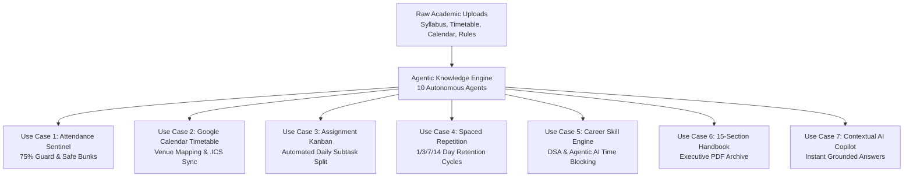

# 🎓 AI Semester Copilot

> **The Autonomous AI Operating System for your Semester**  
> *Architected like Notion AI + Google Calendar + GitHub Copilot*

[](https://github.com/anweshsinghal99-maker/PromptWars)
[](https://python.org)
[](https://fastapi.tiangolo.com)
[](https://react.dev)
[](https://tailwindcss.com)
[](LICENSE)

---

## 🎯 Problem Statement & Why Semester Copilot Exists

### The Modern Student Dilemma: Fragmented Academic Chaos
Engineering and college students are overwhelmed by information overload across disconnected silos:
1. **Scattered Syllabi & Schemes**: 200+ page curriculum PDFs containing Course Learning Outcomes (CLOs) and textbook recommendations that students rarely open until the night before exams.
2. **Static Timetable Images**: Low-resolution JPEG timetables saved on phones that don't provide classroom navigation, conflict alerts, or calendar sync.
3. **The 75% Attendance Trap**: Students inadvertently fall below mandatory attendance requirements because they lack real-time visibility into their **"Safe Bunk" margin** and don't know the mathematical penalty of missing classes.
4. **Panic-Driven Assignment Submissions**: Large multi-hour projects are delayed until the 11th hour, resulting in all-nighters, plagiarized lab reports, and degraded retention.
5. **Brute-Force Cramming vs. Spaced Repetition**: Over 85% of exam preparation relies on last-minute cramming, which leads to rapid memory decay (Ebbinghaus Forgetting Curve) and poor exam performance.
6. **Career Skill Neglect**: Students aspire to master **DSA, Agentic AI, and Full-Stack development**, but abandon self-study roadmaps because university classes consume their high-energy hours without structured time-blocking.

### ❌ Why Generic AI Chatbots Fail
Generic LLMs (ChatGPT, Claude) only answer one-off questions in isolation. They have **no memory of your university timetable**, **no knowledge of your attendance records**, **no understanding of your sleep chronotype**, and cannot synchronize your daily calendar.

### ✅ The Solution: AI Semester Copilot
**Semester Copilot** is an autonomous multi-agent planning engine. Instead of merely answering questions, it ingests academic documents (Syllabus, Timetable, Calendar, Hostel Rules, Campus Map) and synthesizes a **Single Unified Semester Knowledge Graph**.

```
                           Knowledge Graph
                                  ↓
                               Planner
                                  ↓
                              Attendance
                                  ↓
                             Assignments
                                  ↓
                            Study Sessions
                                  ↓
                               Revision
                                  ↓
                            Exam Preparation
```
> **Core Philosophy**: No duplicate data. Everything derives synchronously from one single source of truth.

---

## 💡 Key Student Use Cases & Real-World Value



### 1. 🛡️ Use Case 1: The 75% Attendance Guard & Predictive Safe Bunk Calculator
- **Scenario**: You are feeling unwell on a Friday and want to skip your Chemistry and Electrical lectures.
- **How Copilot Solves It**: The **Attendance Sentinel (Agent 4)** checks your historical records and runs a real-time *"What-If"* simulation. It alerts you that skipping Friday will drop your Electrical Engineering attendance to **72.7% (Danger Threshold)** and warns you that you will need **2 consecutive classes** to recover. Conversely, it informs you that Chemistry has **5 Safe Bunks** remaining, allowing you to make safe, informed choices.

### 2. 🗓️ Use Case 2: Frictionless Class Navigation & Google Calendar Sync
- **Scenario**: It's 11:20 AM and you have a practical session, but you don't remember which building or lab room to go to.
- **How Copilot Solves It**: The **Timetable Engine (Agent 3)** color-codes lectures, labs, and tutorials, explicitly displaying room numbers (e.g. `PL-2 Computer Center`, `CBTL Chemistry Lab G253-A`, `T105 Tan Building`). A 1-click **Export .ICS** button syncs your entire semester into Google Calendar or Apple Calendar with weekly recurring alerts.

### 3. 📋 Use Case 3: Breaking Procrastination with Automated Assignment Deconstruction
- **Scenario**: You have a 5-hour C Programming dynamic memory project due in 3 days.
- **How Copilot Solves It**: The **Assignment Agent (Agent 5)** automatically decomposes the assignment into 4 daily, digestible 45–90 min subtasks across a Kanban board (Scope & Header Layout → Dynamic Allocation `malloc` → File Serialization → Leak Testing & Final Report). You conquer large milestones without last-minute stress.

### 4. 🧠 Use Case 4: Ebbinghaus Spaced Repetition & Chronotype-Calibrated Deep Work
- **Scenario**: You want to score an `A+` in Calculus and Electrical Engineering without burning out.
- **How Copilot Solves It**: The **Revision Agent (Agent 7)** automatically queues learned topics into **1-Day, 3-Day, 7-Day, and 14-Day** active retrieval cycles. The **Study Planner (Agent 6)** positions your focus blocks around your natural **Night Owl (21:30 - 01:00)** or **Morning Learner** chronotype, paired with an integrated Pomodoro timer widget.

### 5. 🚀 Use Case 5: Non-Conflicting Placement & Career Skill Mastery
- **Scenario**: You want to solve the NeetCode 150 DSA list and learn Agentic AI / LangGraph, but academics take over your week.
- **How Copilot Solves It**: The **Skill Planner (Agent 8)** identifies free evening and weekend buffer windows, assigning non-academic roadmaps strictly without ever overlapping with lectures, labs, or sleep.

### 6. 📖 Use Case 6: The 15-Section Executive Semester Handbook (Print & PDF)
- **Scenario**: You need a unified, professional roadmap containing subjects, faculty, exam weightages (MST 30%, EST 40%, Sessional 30%), textbooks, and emergency buffer days.
- **How Copilot Solves It**: The **Handbook Generator (Agent 9)** compiles a structured 15-section handbook with print-ready CSS pagination for 1-click PDF download or physical printing.

### 7. 🤖 Use Case 7: Grounded Natural Language AI Copilot
- **Scenario**: Ask questions like:
  - *"Where is my class right now?"*
  - *"Can I skip tomorrow's lectures?"*
  - *"What should I study tonight?"*
  - *"When is my next exam?"*
- **How Copilot Solves It**: **Agent 10** uses the local semester knowledge graph and Google Gemini API to give immediate, accurate, timetable-grounded answers.

---

## 🏗️ 10 Autonomous AI Agents Overview

| Agent | Name | Primary Functionality & Value |
|---|---|---|
| **Agent 1** | **Document Parser** | Ingests PDF, DOCX, PNG, CSV; extracts courses, credits, L-T-P ratios, faculty, and room numbers. |
| **Agent 2** | **Knowledge Builder** | Creates the single Knowledge Graph uniting courses, exam dates, hostel curfews, and campus venues. |
| **Agent 3** | **Master Planner** | Schedules weekly class grids, free slots, Saturday buffer windows, and circadian sleep-wake routines. |
| **Agent 4** | **Attendance Sentinel** | Computes live attendance %, safe bunk allowances, danger threshold alerts, and what-if simulations. |
| **Agent 5** | **Assignment Agent** | Auto-splits multi-hour projects into daily 40–90 min subtasks across a 3-column Kanban board. |
| **Agent 6** | **Study Planner** | Credit-weighted, difficulty-calibrated study blocks tailored to Morning vs. Night Owl chronotypes. |
| **Agent 7** | **Revision Agent** | Automates Ebbinghaus forgetting curve retention queues at 1, 3, 7, and 14-day intervals. |
| **Agent 8** | **Skill Planner** | Allocates free non-academic hours to DSA, Agentic AI (`UCS714`), and Full-Stack tracks. |
| **Agent 9** | **Handbook Generator** | Synthesizes an executive 15-section printable and PDF-exportable academic handbook. |
| **Agent 10** | **AI Chat Copilot** | Grounded conversational assistant answering schedule, attendance, and exam queries in real-time. |

---

## ⚡ Quick Start Guide (1 Command Setup)

### Prerequisites
- Python 3.10+
- Node.js 18+ & npm

### Method 1: Single Python Launcher (Recommended)
```bash
# 1. Clone the repository
git clone https://github.com/anweshsinghal99-maker/PromptWars.git
cd PromptWars

# 2. Run the all-in-one launcher
python start_all.py
```
*(On Windows, you can also double-click `start_all.bat`)*

---

### Method 2: Manual Start

#### Backend Setup:
```bash
cd backend
pip install -r requirements.txt
uvicorn app.main:app --host 0.0.0.0 --port 8000 --reload
```

#### Frontend Setup:
```bash
cd frontend
npm install
npm run dev
```

Visit the application in your browser:
- 🌐 **Web App Interface:** [http://localhost:3000](http://localhost:3000)
- 📑 **FastAPI Interactive Docs:** [http://localhost:8000/docs](http://localhost:8000/docs)

---

### Method 3: Docker Compose
```bash
docker compose up --build
```

---

## 📊 Pre-Loaded Thapar B.E. (DS & AI) Curriculum

Click **"Try Demo (1-Click Instant Preview)"** on the landing page to immediately explore:
1. **UES103**: Programming for Problem Solving (C language) [4.0 Cr] — *Room T105, Lab PL-2*
2. **UES013**: Electrical and Electronics Engineering [4.5 Cr] — *Room T105/LT102, Lab B105, Tut E311*
3. **UMA022**: Calculus for Engineers (Mathematics - I) [3.5 Cr] — *Room T105/LT102, Tut E311*
4. **UCB009**: Chemistry [4.0 Cr] — *Room T105/LT102, Lab CBTL G253-A*
5. **UEN008**: Energy and Environment [2.0 Cr] — *Room T105*
6. **UAI101**: Foundation of Machine Intelligence [2.0 Cr] — *Room T105*
7. **Featured Elective**: **UCS714** Agentic AI [3.0 Cr]

---

## 🧪 Testing Suite & Automated QA

Run all automated unit tests across the 10 agent algorithms:
```bash
cd backend
python -m pytest tests/test_agents.py
```

```
============================== test session starts ==============================
collected 10 items

tests/test_agents.py::test_agent_1_parser PASSED                          [ 10%]
tests/test_agents.py::test_agent_2_knowledge_builder PASSED              [ 20%]
tests/test_agents.py::test_agent_3_planner PASSED                        [ 30%]
tests/test_agents.py::test_agent_4_attendance PASSED                     [ 40%]
tests/test_agents.py::test_agent_5_assignment PASSED                     [ 50%]
tests/test_agents.py::test_agent_6_study_planner PASSED                  [ 60%]
tests/test_agents.py::test_agent_7_revision PASSED                       [ 70%]
tests/test_agents.py::test_agent_8_skills PASSED                         [ 80%]
tests/test_agents.py::test_agent_9_handbook PASSED                       [ 90%]
tests/test_agents.py::test_agent_10_chat_copilot PASSED                  [100%]

============================== 10 passed in 3.67s ==============================
```

---

## 📄 License
MIT License. Built with passion for **AI Semester Copilot**.
