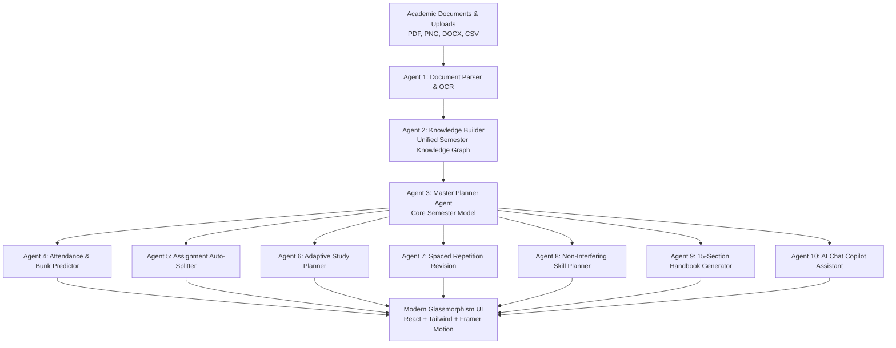

# 🎓 AI Semester Copilot

> **The Autonomous AI Operating System for your Semester**  
> *Notion AI + Google Calendar + GitHub Copilot Architecture*

[](https://python.org)
[](https://fastapi.tiangolo.com)
[](https://react.dev)
[](https://tailwindcss.com)
[](LICENSE)

---

## 🌟 Executive Overview

**AI Semester Copilot** is a production-quality academic orchestration platform. Instead of acting as a generic Q&A bot, it ingests academic syllabi, official course schemes, timetable sheets, hostel rules, and academic calendars to construct a **Unified Semester Knowledge Model**.

All downstream capabilities derive from this single source of truth with **zero duplicate data**:
- **Personalized Google Calendar Timetable** with venue mapping (`T105`, `LT102`, `E311`, `PL-2`, `CBTL`).
- **Attendance Sentinel & Safe Bunk Calculator** with interactive "what-if" predictive simulation.
- **Assignment Auto-Splitter & Kanban Board** breaking multi-hour projects into 40-90 minute daily tasks.
- **Spaced Repetition Study Engine** (1, 3, 7, 14-day Ebbinghaus retention cycles) & Pomodoro Focus widget.
- **Career Skill Roadmaps** (DSA NeetCode 150, Agentic AI / UCS714, Full-Stack) allocated strictly to non-academic slots.
- **15-Section Semester Handbook** formatted for instant reading and high-resolution PDF export.
- **Context-Aware AI Chat Copilot** answering grounded questions (*"Where is my class?"*, *"Can I skip tomorrow?"*).
- **1-Click Try Demo Mode** pre-hydrated with the authentic **Thapar Institute B.E. (DS & AI)** curriculum.

---

## 🏗️ 10-Agent Autonomous Architecture



| Agent | Name | Primary Responsibility |
|---|---|---|
| **Agent 1** | **Document Parser** | Multi-format OCR & text parser (PDF, DOCX, PNG, CSV) extracting courses, L-T-P, credits, and rooms. |
| **Agent 2** | **Knowledge Builder** | Graph builder linking courses, timings, faculty, classrooms, and textbooks into a unified model. |
| **Agent 3** | **Master Planner** | Schedules weekly routines, free gaps, buffer days, and circadian sleep-wake cycles. |
| **Agent 4** | **Attendance Sentinel** | Computes %, safe bunks, danger thresholds, and runs "what-if" predictive skip simulations. |
| **Agent 5** | **Assignment Agent** | Deconstructs multi-hour projects into manageable daily sub-tasks across a 3-column Kanban board. |
| **Agent 6** | **Study Planner** | Credit-weighted, difficulty-calibrated study blocks matched to chronotype (Morning/Night owl). |
| **Agent 7** | **Revision Agent** | Automates 1, 3, 7, and 14-day spaced repetition retention queues before major exams. |
| **Agent 8** | **Skill Planner** | Allocates remaining free hours to DSA, Agentic AI, and Web Dev without academic overlap. |
| **Agent 9** | **Handbook Generator** | Compiles a comprehensive 15-section executive handbook exportable to PDF. |
| **Agent 10** | **Chat Copilot** | Context-grounded AI conversational assistant with quick-action prompts. |

---

## 🚀 Quick Start (1 Install & Run Command)

### Prerequisites
- Python 3.10+
- Node.js 18+ & npm

### Method 1: Single Python Runner (Recommended)
```bash
# 1. Clone & Enter repository
git clone https://github.com/anweshsinghal99-maker/PromptWars.git
cd PromptWars

# 2. Run the all-in-one launcher
python start_all.py
```
*(On Windows you can also double-click `start_all.bat`)*

### Method 2: Manual Start

#### Backend
```bash
cd backend
pip install -r requirements.txt
uvicorn app.main:app --host 0.0.0.0 --port 8000 --reload
```

#### Frontend
```bash
cd frontend
npm install
npm run dev
```

Open your browser at:
- **Web App UI:** [http://localhost:3000](http://localhost:3000)
- **FastAPI Interactive Docs:** [http://localhost:8000/docs](http://localhost:8000/docs)

### Method 3: Docker Compose
```bash
docker compose up --build
```

---

## 📊 Pre-Loaded Thapar B.E. (DS & AI) Dataset

Click **"Try Demo (1-Click)"** on the landing page to immediately explore:
1. **UES103**: Programming for Problem Solving (C language) [4.0 Cr] — *Room T105, Lab PL-2*
2. **UES013**: Electrical and Electronics Engineering [4.5 Cr] — *Room T105, Lab B105, Tut E311*
3. **UMA022**: Calculus for Engineers (Mathematics - I) [3.5 Cr] — *Room T105/LT102, Tut E311*
4. **UCB009**: Chemistry [4.0 Cr] — *Room T105/LT102, Lab CBTL G253*
5. **UEN008**: Energy and Environment [2.0 Cr] — *Room T105*
6. **UAI101**: Foundation of Machine Intelligence [2.0 Cr] — *Room T105*
7. **Special Elective Preview**: **UCS714** Agentic AI [3.0 Cr]

---

## 🛡️ Security & Reliability
- Strict input validation via Pydantic v2.
- Prepared database statements with SQLAlchemy ORM (zero raw SQL).
- CORS whitelisting & safe file handling.
- Graceful offline fallback: The UI works smoothly with high-fidelity mock graph data even during network outages.

---

## 🧪 Testing Suite
Run all unit tests across the 10 agent algorithms:
```bash
cd backend
python -m pytest tests/test_agents.py
```

---

## 📄 License
MIT License. Built for **Antigravity AI Semester Copilot**.
